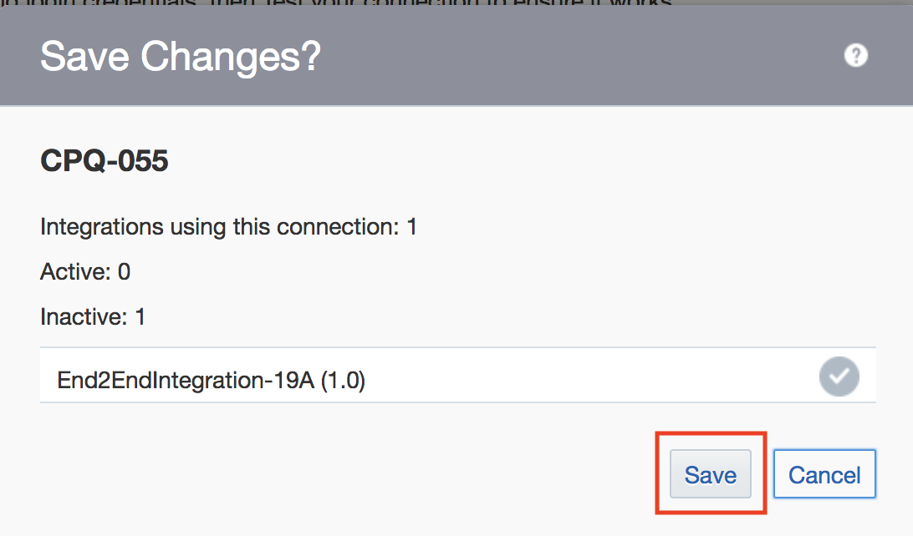

# CPQ CLOUD TO SUBSCRIPTION MANAGEMENT CLOUD INTEGRATION TEST

## BACKGROUND

This document outlines a step-by-step guide on how to import Oracle Integration Cloud (OIC) artifacts from Oracle Cloud Marketplace into an OIC environment, and create web service connections between CPQ Cloud and Subscription Mangement Cloud. This lab will focus on how to create subscriptions and terminate subscriptions in CPQ, and have those changes reflected in Subscripton Managment Cloud.

The business scenario is to allow sales teams to capture subscription orders and perform subscription management activities throughout the lifecycle of these customer relationships. The integration, enabled by Oracle’s next generation Oracle Integration Cloud middleware, comes with a Subscription Management package that includes installable artifacts for both CPQ Cloud and OIC.

## COMPONENTS COVERED

* How to download integration artifacts from Oracle Cloud Marketplace
* How to import integration artifacts into OIC
* How to update web service connections
* How to activate integrations
* How to create subscriptions through CPQ Cloud
* How to terminate subscriptions through CPQ Cloud

## APPLICATIONS USED

* Oracle Integration Cloud (OIC)
  OIC URL: <em>https://oictraining3-oicpm.integration.ocp.oraclecloud.com/ic/home/</em>

* CPQ Cloud
  CPQ URL: <em>https://cpq-20263.bigmachines.com/</em>

* Subscription Management Cloud (OSS)
  OSS URL: <em>https://adc3-zids-login.oracledemos.com</em>

## 1.1 IMPORT INTEGRATION ARTIFACTS FROM ORACLE CLOUD MARKETPLACE

#### 1.1.1: Click <a href="https://cloudmarketplace.oracle.com/marketplace/en_US/adf.task-flow?tabName=O&adf.tfDoc=%2FWEB-INF%2Ftaskflow%2Fadhtf.xml&application_id=53214800&adf.tfId=adhtf" target="_blank">HERE</a> to got to Oracle Cloud Marketplace.

You should get redirected to a prebuilt Oracle CPQ Cloud to Oracle Subscription Cloud app.

&nbsp;

#### 1.1.2: Click on Get App

&nbsp;

#### 1.1.3: Review and accept the Oracle Standard Terms and Restrictons, and click Next

&nbsp;

#### 1.1.4: Scroll to the Details section of the page, click on the "End to End Flow" Integration .jar file from the CPQ- OSS Integration Artifacts table </b>
The OIC Integration for End-to-End Flow contains the integrations for the create subscription, modify subscription, renew subscription, and terminate subscription workflows. This lab will focus on create and terminate.

#### 1.1.5: Save your downloaded .jar file in a directory on your local machine </b>

&nbsp;

&nbsp;

## 1.2: IMPORT INTEGRATION ARTIFACT INTO OIC 

#### 1.2.1: Go to https://integration-orasenatdpltintegration02.integration.ocp.oraclecloud.com

#### 1.2.2: Log in using the credentials your lab facilitator will provide  
Credential: OICMotorolaUser[User Number]

#### 1.2.3: Select Integrations from the left side menu of the OIC home page  

#### 1.2.4: Click on Import from the top right

#### 1.2.5: Click on Browse from the Import Integration dialogue box and select the END2ENDINTEGRATION_19A .jar file. Click on Import  

#### 1.2.6: Your integration is now imported successfully.  

&nbsp;

&nbsp;

## 1.3: CONFIGURE CPQ CLOUD AND SUBSCRIPTION MANAGEMENT CLOUD CONNECTIONS IN OIC 

### 1.3.1: CONFIGURE CPQ CLOUD CONNECTION

#### 1.3.2: Click on Connections from the left side menu under Designer

#### 1.3.3: Search for the CPQ connection in the search box. In this case, "CPQ-055"

#### 1.3.4: Select the CPQ-055 connector. When the connection is displayed, click on the hamburger menu and select Edit

#### 1.3.5: Click on Configure Connectivity

#### 1.3.6: Make sure SOAP WSDL URL is selected under Connection Type. For Connection URL, copy and paste the WSDL URL below. 

Connection URL: https://cpq-20263.bigmachines.com/v2_0/receiver/commerce/oraclecpqo?WSDL

#### 1.3.7: Click on Save from the top right

#### 1.3.8: Click on Configure Security

#### 1.3.9: Provide credentials to access your CPQ application, and click OK

#### 1.3.10: Click on Save from the right top corner, and click Save again from the Save Changes dialogue box. Close the "saved successfully" notification box

#### 1.3.11: Click on Test from the top right

#### 1.3.12: Make sure the connection tests successfully and reflects 100%. Close the green notification box.

#### 1.3.13: Click Save from the top right. click Save again from the Save Changes dialogue box, 

#### 1.3.14: Click Close from the top right

#### 1.3.15: Your CPQ connection is now active

&nbsp;

&nbsp;

## 1.4: CONFIGURE REST CONNECTION for SUBSCRIPTION MANAGEMENT CLOUD

In this lab, we're going to use a REST adapter to connect to Subscripton Management Cloud.

#### 1.4.1: Search the REST connection in the search box. In this case, "OSS_REST_CONN"

#### 1.4.2: Select the OSS_REST_CONN connector. When the connection is displayed, click on the hamburger menu and select Edit

#### 1.4.3: Click on Configure Connectivity 

#### 1.4.4: Make sure REST API Base URL is selected under Connection Type. Provide your REST URL for Connection URL, and click OK. REST URL will be provided by lab facilitator. 

#### 1.4.5: Click on Save from the top right

#### 1.4.6: Click on Configure Security

#### 1.4.7: Provide credentials to access your Subscription Management Cloud application, and click OK

#### 1.4.8: Click on Save from the right top corner, and click Save again from the Save Changes dialogue box. Close the "saved successfully" notification box

#### 1.4.9: Click on Test from the top right

#### 1.4.10: Make sure the connection tests successfully and reflects 100%. Close the green notification box

#### 1.4.11: Click Save from the top right. click Save again from the Save Changes dialogue box

#### 1.4.12: Click Close from the top right

#### 1.4.13: Your REST connection is now active

&nbsp;

&nbsp;

## 1.5: ACTIVATE INTEGRATION

#### 1.5.1: Select Integrations from the left side menu

#### 1.5.1: Find the End2EndIntegration-19A.
