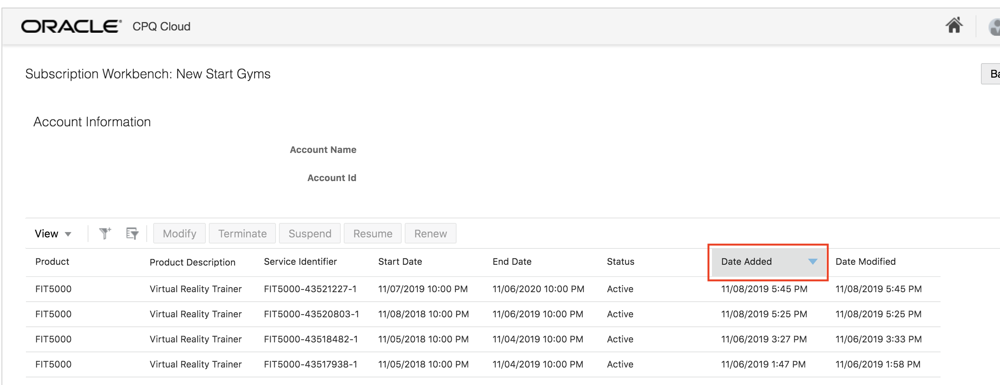

# LAB 2: CPQ CLOUD TO SUBSCRIPTION MANAGEMENT CLOUD INTEGRATION TEST

## BACKGROUND

This document outlines a step-by-step guide on how to import Oracle Integration Cloud (OIC) artifacts from Oracle Cloud Marketplace into an OIC environment, and create web service connections between CPQ Cloud and Subscription Mangement Cloud. This lab will focus on how to create subscriptions and terminate subscriptions in CPQ, and have those changes reflected in Subscripton Managment Cloud.

The business scenario is to allow sales teams to capture subscription orders and perform subscription management activities throughout the lifecycle of these customer relationships. The integration, enabled by Oracle’s next generation Oracle Integration Cloud middleware, comes with a Subscription Management package that includes installable artifacts for both CPQ Cloud and OIC.

&nbsp;

## COMPONENTS COVERED

* How to download integration artifacts from Oracle Cloud Marketplace
* How to import integration artifacts into OIC
* How to update web service connections
* How to activate integrations
* How to create subscriptions through CPQ Cloud
* How to terminate subscriptions through CPQ Cloud

&nbsp;

## APPLICATIONS USED

* Oracle Integration Cloud (OIC)
* CPQ Cloud
* Subscription Management Cloud (OSS)

&nbsp;

## 1.1 IMPORT INTEGRATION ARTIFACTS FROM ORACLE CLOUD MARKETPLACE

#### 1.1.1: Click <a href="https://cloudmarketplace.oracle.com/marketplace/en_US/adf.task-flow?adf.tfDoc=%2FWEB-INF%2Ftaskflow%2Fadhtf.xml&adf.tfId=adhtf&application_id=53214800&tabName=O" target="blank"> HERE</a> to got to Oracle Cloud Marketplace.

You should get redirected to a prebuilt Oracle CPQ Cloud to Oracle Subscription Cloud app.

&nbsp;

#### 1.1.2: Click on Get App

&nbsp;

#### 1.1.3: Review and accept the Oracle Standard Terms and Restrictons, and click Next

&nbsp;

#### 1.1.4: Scroll to the Details section of the page, click on the "End to End Flow" Integration .jar file from the CPQ- OSS Integration Artifacts table </b>
The OIC Integration for End-to-End Flow contains the integrations for the create subscription, modify subscription, renew subscription, and terminate subscription workflows. This lab will focus on create and terminate.

#### 1.1.5: Save your downloaded .jar file in a directory on your local machine </b>

&nbsp;

&nbsp;

## 1.2: IMPORT INTEGRATION ARTIFACT INTO OIC 

#### 1.2.1: Go to Oracle Integration Cloud home page:
OIC URL: <em>https://oictraining3-oicpm.integration.ocp.oraclecloud.com/ic/home/</em>

&nbsp;

&nbsp;

#### 1.2.2: Log in using the same credentials you used for Lab 1  

<strong>OIC User Name</strong>: OICTraining3ic[User Number]  
Your OIC Password will be provided by your lab facilitator.

&nbsp;

#### 1.2.3: After logging in, select Integrations from the left side menu of the OIC home page  

&nbsp;

#### 1.2.4: Click on Integrations again from the left hand side menu, and click on Import from the top right.

&nbsp;

#### 1.2.5: Click on Browse from the Import Integration dialogue box and select the END2ENDINTEGRATION_19A .jar file. Click on Import.  

&nbsp;

#### 1.2.6: Your integration is now imported successfully.  

&nbsp;

&nbsp;

## 1.3: CONFIGURE CPQ CLOUD AND SUBSCRIPTION MANAGEMENT CLOUD CONNECTIONS IN OIC 

### 1.3.1: CONFIGURE CPQ CLOUD CONNECTION

#### 1.3.2: Click on Connections from the left side menu under Designer

&nbsp;

#### 1.3.3: Search for the CPQ connection in the search box. In this case, "CPQ-055"

&nbsp;

#### 1.3.4: Select the CPQ-055 connector. When the connection is displayed, click on the hamburger menu and select Edit

&nbsp;

#### 1.3.5: Click on Configure Connectivity

&nbsp;

#### 1.3.6: Make sure SOAP WSDL URL is selected under Connection Type. For Connection URL, copy and paste the WSDL URL below. 

&nbsp;

Connection URL: https://cpq-20263.bigmachines.com/v2_0/receiver/commerce/oraclecpqo?WSDL

&nbsp;

#### 1.3.7: Click on Save from the top right

&nbsp;

#### 1.3.8: Click on Configure Security

&nbsp;

#### 1.3.9: Provide credentials to access your CPQ application, and click OK

&nbsp;

#### 1.3.10: Click on Save from the right top corner, and click Save again from the Save Changes dialogue box. Close the "saved successfully" notification box

&nbsp;

#### 1.3.11: Click on Test from the top right

&nbsp;

#### 1.3.12: Make sure the connection tests successfully and reflects 100%. Close the green notification box.

&nbsp;

#### 1.3.13: Click Save from the top right. click Save again from the Save Changes dialogue box, 

&nbsp;

#### 1.3.14: Click Close from the top right

&nbsp;

#### 1.3.15: Your CPQ connection is now active

&nbsp;

&nbsp;

## 1.4: CONFIGURE REST CONNECTION for SUBSCRIPTION MANAGEMENT CLOUD

In this lab, we're going to use a REST adapter to connect to Subscripton Management Cloud.

#### 1.4.1: Search the REST connection in the search box. In this case, "OSS_REST_CONN"

&nbsp;

#### 1.4.2: Select the OSS_REST_CONN connector. When the connection is displayed, click on the hamburger menu and select Edit

&nbsp;

#### 1.4.3: Click on Configure Connectivity 

&nbsp;

#### 1.4.4: Make sure REST API Base URL is selected under Connection Type. Provide your REST URL for Connection URL, and click OK. REST URL will be provided by lab facilitator. 

&nbsp;

#### 1.4.5: Click on Save from the top right

#### 1.4.6: Click on Configure Security

&nbsp;

#### 1.4.7: Provide credentials to access your Subscription Management Cloud application, and click OK

&nbsp;

#### 1.4.8: Click on Save from the right top corner, and click Save again from the Save Changes dialogue box. Close the "saved successfully" notification box

#### 1.4.9: Click on Test from the top right

#### 1.4.10: Make sure the connection tests successfully and reflects 100%. Close the green notification box

#### 1.4.11: Click Save from the top right. click Save again from the Save Changes dialogue box

#### 1.4.12: Click Close from the top right

&nbsp;

#### 1.4.13: Your REST connection is now active

&nbsp;

&nbsp;

## 1.5: ACTIVATE INTEGRATION

#### 1.5.1: Select Integrations from the left side menu

&nbsp;

#### 1.5.2: Find the End2EndIntegration-19A. Hover over the integration and click on the power switch

&nbsp;

#### 1.5.3: From the Activation Integration dialogue box, select Enable Tracing and Include Payload

&nbsp;

#### 1.5.4: Click on Activate

## 1.6: CLONE INTEGRATION

#### 1.6.1: Hover over the activated integration, and select the hamburger menu. Select Clone from the action items list

&nbsp;

#### 1.6.2: Rename the integration as follows: "User [insert user number] End2Endintegration". Click Clone.

&nbsp;

#### 1.6.3: Hover over your cloned integration and click on the power switch

&nbsp;

#### 1.6.4: From the Activation Integration dialogue box, select Enable Tracing and Include Payload. Click on Activate

&nbsp;

&nbsp;

## 1.7: CREATE A SUBSCRIPTION IN SUBSCRIPTION MANGEMENT CLOUD

#### 1.7.1: Go to Subscription Management Cloud home page:
OSS URL: <em>https://adc3-zids-login.oracledemos.com</em>

&nbsp;

&nbsp;

#### 1.7.2: Log in using the same credentials you used for Lab 1  

Your OSS login credientals will be provided by your lab facilitator.

&nbsp;

#### 1.7.3: Click on the home icon  

&nbsp;

#### 1.7.4: Under Sales Cloud, select Opportunities  

&nbsp;

#### 1.7.5: Click on Create Opportunity from the top right  

&nbsp;

#### 1.7.6: Insert Opportunity Name. "FIT 5000 Purchase User [user name]".  
Account: New Start Gyms  
Primary Contact: Lisa Lauber  

&nbsp;

Click Save and Close  

#### 1.7.7: Select the opportunity you created from the Opportunities list  

&nbsp;

#### 1.7.8: Select Quotes and Order from the Left hand side menu  

&nbsp;

#### 1.7.9: Click on Create Quote from the top right  

&nbsp;

&nbsp;

This will now redirect you to the embedded CPQ application.

&nbsp;

#### 1.7.10: Under Line Item Details, click on Add  

&nbsp;

#### 1.7.11: Select Supremo Fitness, and choose VR Cardio from the products list  

&nbsp;

#### 1.7.12: Click on product FIT5000  

&nbsp;

#### 1.7.13: Under the Subscription Services drop down, select cCoach-12month. Select Yearly from the Monitoring drop down, and click Update from the top right  

&nbsp;

#### 1.7.14: Click Add to Transaction  

&nbsp;

#### 1.7.15: Your product is now added to the quote. Click Save  

&nbsp;

#### 1.7.16: Click Submit  

&nbsp;

#### 1.7.17: Click Submit Order  

Make sure to note down the Transaction Number!

&nbsp;

#### 1.7.18: Click Return to Sales Cloud  

&nbsp;

#### 1.7.18: Click Save and Close  

&nbsp;

&nbsp;

## 1.8: CHECK CREATE SUBSCRIPTION INTEGRATION WORK FLOW

#### 1.8.1: Go to the OIC Home Page. Select Monitoring from the left side menu  

&nbsp;

#### 1.8.2: Click Integrations  

&nbsp;

#### 1.8.3: Click Tracking  

&nbsp;

#### 1.8.4: Find you integration, and click on the Id number  

&nbsp;

#### 1.8.5: Understand and explain the Create Subscription integration flow  

&nbsp;

&nbsp;

## 1.9: CHECK CREATED SUBSCRIPTION IN SUBSCRIPTION CLOUD

&nbsp;

#### 1.9.1: Return to Subscription Cloud Home Page  

&nbsp;

#### 1.9.2: Click on the hamburger menu from the top left  

&nbsp;

#### 1.9.3: Click Subscription Management from the list  

&nbsp;

#### 1.9.4: Enter your quote Transaction Number to find your subscription, and search  

&nbsp;

#### 1.9.5: You now see your product, and your subscription listed in Subscription  

&nbsp;

&nbsp;

## 1.20: TERMINATE SUBSCRIPTON

#### 1.20.1: In Subscription Managment Cloud, click on the hamburger menu on the top left  

&nbsp;

#### 1.20.2: Under Sales Cloud, select Opportunities   

&nbsp;

#### 1.20.3: Search and select the opportunity you created in the Find field  

&nbsp;

#### 1.20.4: Click Quotes and Order from the left side menu 

&nbsp;

#### 1.20.5: Click on Create Quote  

&nbsp;

#### 1.20.6: Change the year in Start Contract Date and End Contract Date to reflect the screen shot below, and click Save  

&nbsp;

#### 1.20.7: Click Customer Assets  

&nbsp;

#### 1.20.8: Double on the Date Added arrow to find the product you recently subscribed to  

&nbsp;

#### 1.20.9: Select your product  

&nbsp;

#### 1.20.10: Click Terminate  

&nbsp;

#### 1.20.11: Click Terminate  
Under Line Item Details, if you scroll all the way to the right, you'll notice that the Action Code for the subscription now reflects Terminate.

&nbsp;

#### 1.20.12: Click Submit  

&nbsp;

#### 1.20.13: Click Submit Order  

&nbsp;

#### 1.20.14: Click Return to Sales Order  

&nbsp;

#### 1.20.15: Click Save and Close  

&nbsp;

&nbsp;

## 1.21: CHECK TERMINATED SUBSCRIPTON IN SUBSCRIPTION MANGEMENT CLOUD

#### 1.21.1: Click on the hamburger menu from the top left  

&nbsp;

#### 1.21.2: Select Subscription Management from the list  

&nbsp;

#### 1.21.3: Enter your orginal Transaction Number to find your subscription, and search  

&nbsp;

#### 1.21.4: You now see your your subscription is closed  

&nbsp;

## 1.22: CHECK TERMINATE SUBSCRIPTION INTEGRATION WORK FLOW

#### 1.8.1: Go to the OIC Home Page. Select Monitoring from the left side menu  

&nbsp;

#### 1.8.2: Click Integrations  

&nbsp;

#### 1.8.3: Click Tracking  

&nbsp;

#### 1.8.4: Find you integration, and click on the Id number  

&nbsp;

#### 1.8.5: Understand and explain the terminate subscription integration flow  

&nbsp;

&nbsp;

You have now completed this lab.